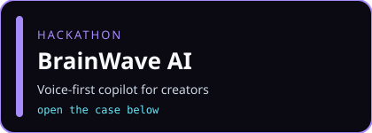
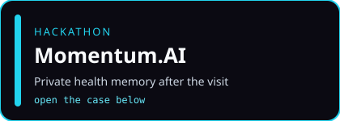
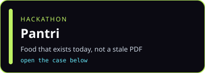
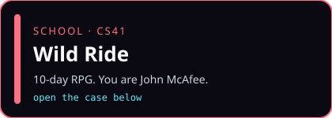
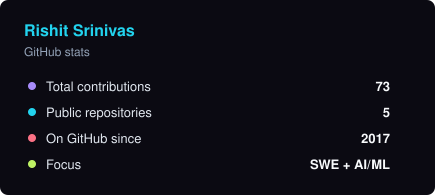
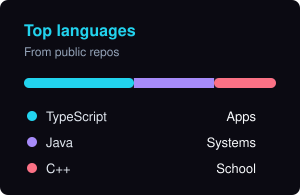

  

  

  
  
  
  
  
  

I'm **Rishit Srinivas**, Computer Science at **San José State**. I ship weekend products and class builds that are supposed to feel a little impossible.

> view my portfolio and reach out  
> — [rishitsrinivas.com](https://rishitsrinivas.com)

<b>🎮 What do you want to see?</b> — click one

 

🧠 I like AI that talks back

**BrainWave AI** — voice-first copilot for creators. Plans the video, unsticks the edit, reads the audience after you publish.

→ [Devpost writeup](https://devpost.com/software/brainwave-ai) · [Hackathons folder](./hackathons)

❤️ I care about health, privacy, doctors

**Momentum.AI** — the visit becomes a private health memory. Summaries, follow-ups, autofilled paperwork. Google Cloud underneath.

→ [Devpost writeup](https://devpost.com/software/momentum-ai) · [Hackathons folder](./hackathons)

🍳 I want something that feeds people

**Pantri** — live food-bank hours and restaurant surplus. A meal that exists *today*, not a directory from 2019.

→ [Devpost writeup](https://devpost.com/software/pantri-rxsu1v) · [Hackathons folder](./hackathons)

🎮 I want the weird game

**Wild Ride** — 10-day CS41 RPG. You are John McAfee. Belize goes sideways. Miami is the extract. We called it gold.

  

→ [Open the repo](https://github.com/hellowworld-ctrl/John-McAfrees-Wild-Ride-Third-Week-Anniversary-Edition-Collectors-Edition) · [School folder](./school)

🗂️ Just give me the two folders

- 💡 [Hackathons](./hackathons) — BrainWave, Momentum.AI, Pantri, Helix, Crush-Depth
- 🎓 [School](./school) — Wild Ride, Canvas-Ultra, Shape-Family, movie-diary

<table>
<tr>
<td width="50%" valign="top">

<b>Open BrainWave AI</b>

Voice-first AI copilot for creators.

- Plan the next video out loud
- Unstick an edit when the timeline fights back
- Turn a finished cut into audience insight

[Devpost](https://devpost.com/software/brainwave-ai) · [Folder](./hackathons)

</td>
<td width="50%" valign="top">

<b>Open Momentum.AI</b>

Doctor visit → private health memory.

- AI summaries after the appointment
- Trusted follow-ups
- Autofilled paperwork
- Privacy first, Google Cloud underneath

[Devpost](https://devpost.com/software/momentum-ai) · [Folder](./hackathons)

</td>
</tr>
<tr>
<td width="50%" valign="top">

<b>Open Pantri</b>

Real-time food access, not a stale list.

- Food-bank hours that are actually true today
- Restaurant surplus matched to people nearby
- Groceries or a hot meal — pick a need, get a place

[Devpost](https://devpost.com/software/pantri-rxsu1v) · [Folder](./hackathons)

</td>
<td width="50%" valign="top">

<b>Open Wild Ride</b>

San José State · CS41 · 10 days · Spring 2024  
Status: gold — May 6, 2024

C++ RPG. Original score. Too many `.wav` files.

[Repo](https://github.com/hellowworld-ctrl/John-McAfrees-Wild-Ride-Third-Week-Anniversary-Edition-Collectors-Edition) · [Folder](./school)

</td>
</tr>
</table>

<b>More in the cabinets</b> — Helix, Crush-Depth, Canvas-Ultra, the other class builds

- **Helix** — compression / reconstruction experiments · [folder](./hackathons)
- **Crush-Depth** — deep-dive build on the personal-site roster · [folder](./hackathons)
- **Canvas-Ultra** — Canvas, but less miserable. Visibility unchanged. · [folder](./school)
- **Shape-Family** — C++ shapes, inheritance, the classics · [repo](https://github.com/RishitSrinivas/Shape-Family)
- **movie-diary-linked-list** — pointers, files, sorting, movies · [repo](https://github.com/RishitSrinivas/movie-diary-linked-list)

  

  <code>TypeScript</code> · <code>Java</code> · <code>C++</code> · <code>Python</code> · <code>React</code> · <code>Google Cloud</code>

  
  
  

  

